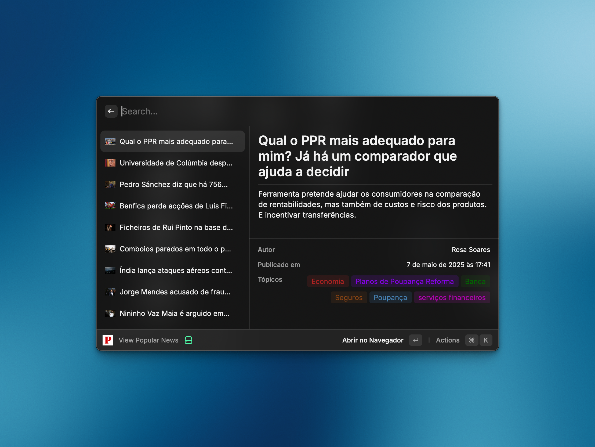

# 📰 Raycast Público


Get the latest headlines from [Público](https://www.publico.pt/) without leaving Raycast. Browse the most relevant stories, keep up with breaking news, or search for articles right from your command bar.



## ✨ Features
- Real-time feed of the latest Público headlines
- Curated view of the most popular stories
- Full-text search with rich article previews
- Quick actions to open or copy article links

## 🧭 Commands
| Command | Description |
| --- | --- |
| `View Latest News` | Shows the most recent headlines from Público |
| `View Popular News` | Brings up trending and most-read articles |
| `Search News` | Search Público's archive and preview article details |

## 🚀 Getting Started
```bash
git clone https://github.com/caasols/raycast-publico.git
cd raycast-publico
npm install
npm run dev
```

- `npm run lint` — check coding style and Raycast best practices
- `npm run fix-lint` — automatically fix linting issues (where possible)
- `npm run build` — bundle the extension for release

## 🛒 Publish to the Raycast Store
1. Make sure you are logged in: `ray login`
2. Update `CHANGELOG.md` with the changes you are releasing
3. Run `npm run build` and address any warnings or errors
4. Publish: `npm run publish`
5. Complete the store submission in the Raycast dashboard (screenshots, description, categories)

> ℹ️ Raycast reviews each submission. Double-check that API usage complies with Público's terms of service and that the extension works without additional credentials.

## 🤝 Contributing
Issues and pull requests are welcome! Please open a discussion if you plan to work on a larger change so we can align on the approach.

## ⭐ Support
If this extension saves you time:
- Star the [GitHub repository](https://github.com/caasols/raycast-publico)
- Share it with coworkers who live in their command bar
- Report bugs or enhancements via GitHub issues

## 📄 License
Released under the [MIT License](./LICENSE).
